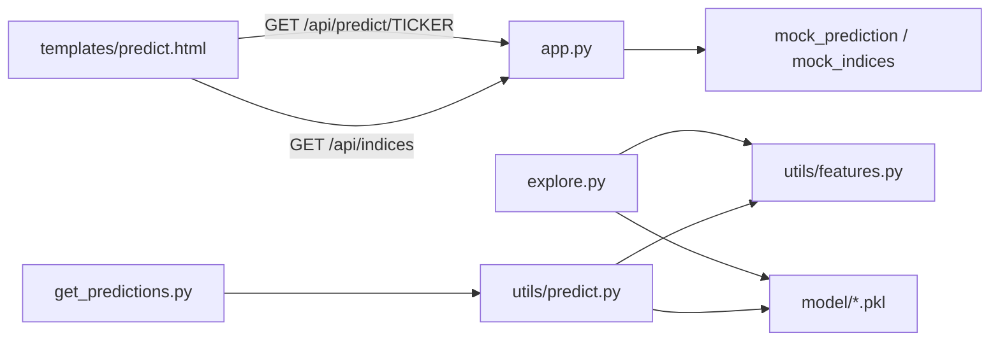

# Kouros Self-Directed Learning Plan

A hands-on curriculum for understanding the **stub Flask backend** and **retraining models for better accuracy**. This document is a learning guide — not code to copy into the repo. **You write every implementation yourself.**

This is an experimental ML project, **not financial advice**.

---

## How to use this plan

### Goal

Learn machine learning evaluation, feature engineering, training workflows, and API design by working on a real codebase — not by generating code from an assistant.

### Rules

1. **You write every line** of new code (scripts, tests, edits to existing files).
2. **Do not outsource phases** to Cursor, ChatGPT, or other codegen tools. Use docs, books, and sklearn/pandas references instead.
3. **Keep a lab log** — create `docs/lab-notes.md` (or a paper notebook). For each experiment record: hypothesis, what changed, metrics, what failed, next step.
4. **Commit small and often** after each checkpoint, e.g. `eval: add majority-class baseline on AAPL`.
5. **Measure before tuning.** Never claim “better accuracy” without comparing to a baseline on the same split.

### Setup

```bash
python3 -m venv venv
source venv/bin/activate
pip install -r requirements.txt
pip install matplotlib   # needed for training plots, not in requirements.txt
```

Run the dashboard:

```bash
python app.py
# Open http://127.0.0.1:5001
```

### Repo map

| Path | Role |
|------|------|
| `app.py` | Flask stub backend — seeded fake JSON, no ML imports |
| `templates/predict.html` | Single-page prediction terminal UI |
| `explore.py` | Training script (AAPL, RandomForest, saves `model/`) |
| `utils/features.py` | Feature engineering shared by train + predict |
| `utils/predict.py` | Load model, fetch data, run inference |
| `utils/watchlist.py` | Default 50-ticker batch list |
| `get_predictions.py` | CLI batch runner over the real model |
| `model/scaler.pkl`, `model/trained_model.pkl` | Saved artifacts |

### Architecture



**Two paths today:**

- **Stub path (web UI):** Browser → Flask → locally generated fake data. No network, no yfinance, no model.
- **ML path (offline):** `explore.py` / `get_predictions.py` → yfinance → features → model. Not wired to Flask yet.

---

## API contract (UI expectations)

Before changing the backend, understand what `templates/predict.html` consumes. Grep the file yourself to find exact usage; this table is your checklist.

### `GET /api/predict/<ticker>`

| Field | Type | UI usage |
|-------|------|----------|
| `ticker` | string | Hero ticker, stock table |
| `sector` | string | Hero subtitle |
| `direction` | `"up"` \| `"down"` | Confidence card, hero styling |
| `confidence` | number (0–100) | Confidence card, last-5 row |
| `predicted_date` | ISO date string | Hero date, index ticker |
| `features.rsi` | number | Feature grid |
| `features.macd` | number | Feature grid |
| `features.bollinger` | number | Feature grid (labeled Bollinger) |
| `features.volatility` | number | Feature grid |
| `features.volume_change` | number | Feature grid |
| `trends.*` | number[7] | 7-day sparklines per feature |
| `history.dates` | string[] | Chart x-axis |
| `history.prices` | number[] | Line chart, hero price |
| `history.ohlc` | `{o,h,l,c}[]` | Candlestick chart + tooltips |
| `last5[]` | `{date, call, confidence, hit}` | Last 5 calls row |
| `stock_hit_rate.rate` | number | Stock performance table |
| `stock_hit_rate.calls` | number | Stock performance table |

### `GET /api/indices`

| Field | Type | UI usage |
|-------|------|----------|
| `symbol` | string | Ticker marquee |
| `name` | string | Ticker marquee |
| `direction` | `"up"` \| `"down"` | Arrow + color |
| `confidence` | number | Marquee percent |
| `predicted_date` | ISO date string | Marquee “when” label |

**Your future real backend must return this shape** (or you update the UI — prefer matching the stub first).

---

## Suggested timeline

| Week | Phases | Focus |
|------|--------|-------|
| 1 | A + B | Stub backend + honest evaluation |
| 2 | C | Feature experiments |
| 3 | D | Multi-ticker training |
| 4 | E + F | Tuning + walk-forward backtest |
| 5+ | G | Optional Flask integration |

Adjust pace to your schedule. Quality of understanding beats speed.

---

## Phase A — Own the stub backend

### Why

The UI already works against fake data in `app.py`. You should understand the contract and seeding before swapping in real predictions.

### Read first

- `app.py` — module docstring, `_rng()`, `mock_prediction()`, `mock_indices()`
- `templates/predict.html` — search for `fetch("/api/` and `renderPrediction`

### Concepts

- **Deterministic stub:** `_rng(ticker)` hashes the ticker to seed `random.Random`, so the same symbol always returns the same fake payload (useful for UI dev).
- **Isolation:** Flask intentionally imports nothing from `utils/`, `yfinance`, or `joblib` — stub runs offline with zero external deps.

### Your tasks

1. Start the server. Search `AAPL`, `MSFT`, `AAPL` again — confirm identical responses for the same ticker.
2. Run `curl -s localhost:5001/api/predict/AAPL | python3 -m json.tool` and compare every top-level key to the API table above.
3. In your lab log, write a one-line mapping for each JSON field → UI element (grep `predict.html` for `p.ticker`, `p.features`, etc.).
4. **(Stretch)** Pick one stub improvement and implement it yourself, e.g.:
   - Make `sector` deterministic per ticker (hash-based pick from `SECTORS`)
   - Assert every OHLC bar has `l <= min(o,c) <= max(o,c) <= h` in a tiny validation script you write

### Verify

- [ ] Same ticker → same JSON on repeated requests
- [ ] Invalid ticker (e.g. `FAKE123`) returns 404
- [ ] `/api/indices` returns an array of 7 index objects with all required fields

### Checkpoint

In your own words (lab log or aloud to yourself): *Why does stub data use seeded RNG? Why does Flask avoid importing `utils/`?*

---

## Phase B — Fix evaluation before tuning

### Why

`explore.py` reports roughly **52% cross-validated accuracy** and **~57% holdout** on AAPL alone. If live predictions feel like ~49%, the problem may be **evaluation methodology**, **overfitting to one ticker**, or **no edge over random** — not just “wrong hyperparameters.”

Fix measurement first. Tuning a broken eval pipeline wastes time.

### Read first

- `explore.py` — data download, target creation, `TimeSeriesSplit`, train/test split, model save
- `utils/features.py` — `FEATURE_COLS`, rolling windows, warm-up rows
- Sklearn docs: [TimeSeriesSplit](https://scikit-learn.org/stable/modules/generated/sklearn.model_selection.TimeSeriesSplit.html), [Pipeline](https://scikit-learn.org/stable/modules/generated/sklearn.pipeline.Pipeline.html)

### Concepts

| Concept | What to learn |
|---------|----------------|
| **Time leakage** | Future data must never influence past predictions. No shuffling. Scaler fit only on training folds. |
| **Baseline accuracy** | Random guess ≈ 50% for balanced classes. Majority-class predictor is another baseline. |
| **CV vs holdout** | TimeSeriesSplit gives multiple temporal folds; single 80/20 split can get lucky. |
| **Confusion matrix** | TP/FP/TN/FN — accuracy alone hides class imbalance effects. |
| **Precision / recall** | Useful when “always predict up” gets high accuracy in bull markets. |

### Your tasks

1. **Create `eval_baseline.py`** (your file — do not copy from AI). Reproduce:
   - Download AAPL from 2021-01-01 (`explore.py` lines 16–22)
   - `compute_features()` + target: next-day up = `(Close.shift(-1) > Close)`
   - Drop last row and NaNs
2. **Print baselines:**
   - Theoretical random accuracy (50%)
   - Majority-class accuracy on your test set
   - Mean `TimeSeriesSplit` CV accuracy using a `Pipeline([StandardScaler(), RandomForest(...)])` with the same hyperparams as `explore.py`
3. **Audit for leakage:** Read whether your CV pipeline refits the scaler inside each fold (it should, if using sklearn `Pipeline`). Note findings in lab log.
4. **Temporal test set:** Hold out the last 20% of rows by time. Train on first 80%, evaluate on last 20%. Plot a **confusion matrix** with matplotlib. Save to `docs/plots/confusion_aapl.png` (create directories yourself).

### Verify

- [ ] `eval_baseline.py` runs without error
- [ ] You report: CV mean, temporal test accuracy, majority baseline — all in lab log
- [ ] Confusion matrix PNG exists

### Checkpoint

Lab log entry: *“My honest out-of-sample accuracy on AAPL is ___%; majority baseline is ___%.”*

---

## Phase C — Feature experiments (one change at a time)

### Why

`utils/features.py` defines 8 features. Next-day direction is noisy; small, **lagged**, **interpretable** changes beat adding 50 indicators at once.

### Read first

- `utils/features.py` — every line of `compute_features()`
- Feature importances printed by `explore.py` after training
- Optional: [Advances in Financial Machine Learning](https://www.amazon.com/Advances-Financial-Machine-Learning-Marcos/dp/1119482089) — chapter on labeling and leakage (library book / skim summaries)

### Your tasks

Implement **at least three** of the following — **one at a time**, re-run `eval_baseline.py` after each:

1. **Lagged features:** Add `pct_change_lag1`, `rsi_lag1` (shift by 1 day). Never use same-day info that wouldn’t exist at prediction time.
2. **Market context:** Download SPY for the same dates. Add `spy_pct_change` or stock return minus SPY return.
3. **RSI variant:** Document current simple rolling RSI (lines 25–29). Try Wilder’s smoothing in a branch; compare CV — keep whichever wins or document tie.
4. **Feature pruning:** Drop the lowest-importance column from `FEATURE_COLS`; re-evaluate.
5. **Warm-up audit:** Log how many rows `dropna()` removes and why (MACD EWM, 20-day MA, etc.).

### Rule

After **every** change:

1. Update `FEATURE_COLS` in `utils/features.py`
2. Re-run `eval_baseline.py`
3. Add a row to a table in `docs/lab-notes.md`:

| Version | Features changed | CV accuracy | Test accuracy | Notes |
|---------|------------------|-------------|---------------|-------|

### Verify

- [ ] At least 3 experiments logged with before/after metrics
- [ ] No experiment bundles multiple unrelated changes

### Checkpoint

Either:

- A feature set that beats your Phase B CV baseline by **≥1–2 percentage points**, or
- A written post-mortem explaining why none did (equally valuable for learning)

---

## Phase D — Multi-ticker training

### Why

Single-ticker AAPL model overfits one stock and one market regime. `utils/watchlist.py` lists 50 symbols for broader training data.

### Read first

- `utils/watchlist.py` — `DEFAULT_WATCHLIST`
- `utils/yfinance_setup.py` — session and cache (use for batch downloads)
- `explore.py` — how target and features are built per dataframe

### Concepts

- **Pooled training:** Concatenate rows from many tickers → more samples, but rows are not IID (same-day market correlation).
- **Split strategies:** (a) split by global date — all tickers on test dates held out; (b) split per ticker then pool — document tradeoffs and leakage risk in lab log.

### Your tasks

1. **Create `train_multi.py`** (your file) that:
   - Loops over watchlist tickers (start with 5–10, scale up when stable)
   - Downloads OHLCV, builds features + target per ticker
   - Concatenates into one dataframe (optional `ticker` column for analysis)
   - Trains with TimeSeriesSplit CV on the combined timeline
2. **Backup** existing artifacts: `mkdir -p model/backup && cp model/*.pkl model/backup/`
3. When CV satisfies you, save new `model/scaler.pkl` and `model/trained_model.pkl`
4. Run `python get_predictions.py` and manually inspect 5–10 lines — do directions look plausible?

### Verify

- [ ] `train_multi.py` completes without error
- [ ] Lab log records: tickers used, row count, CV score, date trained
- [ ] Old model backed up

### Checkpoint

New model artifacts on disk + lab note comparing multi-ticker CV to single-ticker AAPL CV from Phase B.

---

## Phase E — Hyperparameter search (small, disciplined grid)

### Why

Default RandomForest params in `explore.py` may be overfitting (`max_depth=20` on limited data). Search small grids you can explain.

### Read first

- `explore.py` lines 78–89 — commented `GridSearchCV` example
- Sklearn docs: [GridSearchCV](https://scikit-learn.org/stable/modules/generated/sklearn.model_selection.GridSearchCV.html), [RandomForestClassifier](https://scikit-learn.org/stable/modules/generated/sklearn.ensemble.RandomForestClassifier.html)

### Your tasks

1. Add a **≤3 parameter** grid you understand, e.g. `max_depth`, `min_samples_leaf`, `n_estimators`
2. Run GridSearchCV with `TimeSeriesSplit(n_splits=5)` on your best feature set from Phase C/D
3. Compare **RandomForest** vs **LogisticRegression** on the **identical CV splits** (LogisticRegression stub exists in `explore.py`)
4. **(Optional)** Read about [CalibratedClassifierCV](https://scikit-learn.org/stable/modules/generated/sklearn.calibration.CalibratedClassifierCV.html) — does `predict_proba` align with actual hit rate?

### Rules

- Use **CV score** to pick params — never tune on the final test set
- Record `best_params_` and `best_score_` in lab log

### Verify

- [ ] Grid search completes; best params documented
- [ ] Model comparison table in lab log (RF vs LR)

### Checkpoint

One paragraph in lab log: *which model you chose, why, and what CV accuracy you trust.*

---

## Phase F — Walk-forward backtest for UI fields

### Why

The UI displays `last5` (recent calls with hit/miss) and `stock_hit_rate`. Today `app.py` fakes these with RNG. Real values require **historical simulation**: at each past date, predict using only data available before that date, then compare to what actually happened.

### Read first

- `app.py` — shape of `last5` and `stock_hit_rate` in `mock_prediction()`
- Phase A API table

### Concepts

- **Walk-forward / expanding window:** For date *t*, features use rows `< t`, target is direction from *t* to *t+1*
- **Frozen model vs retrain:** Simpler = one model trained on early data, score all later days; harder = retrain periodically (document choice)
- **Hit rate:** `correct_predictions / total_predictions`

### Your tasks

1. **Create `backtest.py`** (your file) for one ticker (start with AAPL):
   - Loop over the last N trading days (e.g. 60)
   - At each step, produce direction + confidence using your saved model (only past data)
   - Compare prediction to actual next-day direction → set `hit` true/false
2. Build output matching stub shape:

```json
{
  "last5": [
    { "date": "2026-06-25", "call": "up", "confidence": 58.1, "hit": true }
  ],
  "stock_hit_rate": { "rate": 55.2, "calls": 60 }
}
```

3. Print JSON to stdout — **do not wire Flask yet**
4. Validate keys match Phase A table

### Verify

- [ ] `backtest.py` runs for AAPL
- [ ] Output JSON parses and has correct keys
- [ ] Hit rate is computed from actual outcomes, not random

### Checkpoint

Save one sample JSON to `docs/samples/backtest_aapl.json` and note hit rate vs 50% baseline in lab log.

---

## Phase G — Optional Flask integration

**Only after Phases B–F.** The stub path must keep working for UI development.

### Your tasks

1. Design a config flag you control, e.g. environment variable `USE_STUB=1` (default on) or a constant at top of `app.py`
2. When stub is off, call a **helper you write** (e.g. `utils/dashboard.py` or similar) that:
   - Downloads real OHLCV via existing `utils/predict.py` / yfinance patterns
   - Runs the model for direction + confidence
   - Builds `history`, `features`, `trends` from real data
   - Calls your `backtest.py` logic for `last5` and `stock_hit_rate`
   - Returns the **same JSON shape** as `mock_prediction()`
3. Keep `mock_prediction()` and `mock_indices()` untouched for stub mode
4. Invalid ticker format should still return 404

### Verify

- [ ] `USE_STUB=1 python app.py` — UI works as before
- [ ] `USE_STUB=0 python app.py` — UI loads AAPL with real data, no JS console errors
- [ ] Toggling stub does not require editing frontend code

### Checkpoint

Lab log: describe your flag design and one known limitation of the real path (e.g. rate limits, market hours, missing OHLC).

---

## Success checklist

You have completed this plan when you can check all boxes:

- [ ] I can explain stub vs real ML paths in this repo
- [ ] I measured baseline accuracy before claiming any improvement
- [ ] I changed features one at a time and logged results in `docs/lab-notes.md`
- [ ] I retrained on multiple tickers and saved new model artifacts (with backup)
- [ ] I built a walk-forward backtest producing real `last5` and `stock_hit_rate`
- [ ] (Optional) I integrated real predictions behind a flag without deleting stub code

---

## What this plan excludes

- Steps that say “ask AI to implement X”
- Copy-paste code blocks meant to drop into the repo
- Any promise of profitable trading — the goal is **methodology and learning**
- Production deployment, auth, or rate limiting (out of scope)

---

## Recommended reading (external)

| Topic | Resource |
|-------|----------|
| Time-series CV | [sklearn TimeSeriesSplit](https://scikit-learn.org/stable/modules/generated/sklearn.model_selection.TimeSeriesSplit.html) |
| Pipeline + CV | [sklearn Pipeline](https://scikit-learn.org/stable/modules/compose.html) |
| Random Forest | [sklearn RandomForestClassifier](https://scikit-learn.org/stable/modules/generated/sklearn.ensemble.RandomForestClassifier.html) |
| Confusion matrix | [sklearn confusion_matrix](https://scikit-learn.org/stable/modules/generated/sklearn.metrics.confusion_matrix.html) |
| yfinance | [yfinance GitHub](https://github.com/ranaroussi/yfinance) |
| Financial ML pitfalls | Search “backtest overfitting finance” and “lookahead bias trading” |

---

## Files you will create (your work)

| File | Phase |
|------|-------|
| `docs/lab-notes.md` | Ongoing |
| `docs/plots/confusion_aapl.png` | B |
| `eval_baseline.py` | B |
| `train_multi.py` | D |
| `backtest.py` | F |
| `docs/samples/backtest_aapl.json` | F |
| `utils/dashboard.py` (or similar) | G (optional) |

None of these exist yet by design — **you create them as you progress.**
